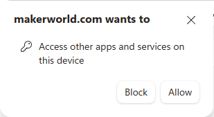

# Bambu to Snapmaker U1 — Chrome Extension 

A Chrome extension that adds a **Snapmaker U1** option to MakerWorld's printer filter carousel. Selecting it converts any model's print profile from Bambu Lab format to Snapmaker U1 format and downloads the converted `.3mf` file — entirely in your browser, no external software required.

> [!IMPORTANT]
> This is an independent, unofficial project. It is not affiliated with,
> endorsed by, sponsored by, or supported by MakerWorld, Bambu Lab, or
> Snapmaker. MakerWorld, Bambu Lab, Snapmaker, and related product names and
> trademarks belong to their respective owners.

## How it works

The extension injects a **Snapmaker U1** tile into the printer filter carousel on any MakerWorld model page. Clicking it swaps the download button to **Convert to Snapmaker U1**. One more click intercepts MakerWorld's own authenticated download, converts the `.3mf` in-browser using bundled conversion logic, and saves the result automatically.

*The injected Snapmaker U1 option appears alongside the standard printer filters.*

---

*Selecting Snapmaker U1 changes the download button to Convert to Snapmaker U1.*

---

*While conversion runs, the button shows a spinner and "Converting profile".*

---

*The converted file is named after the original model with a `-U1.3mf` suffix.*

## First Use

The first time you click **Convert to Snapmaker U1**, your browser may show a prompt like this:

Depending on the browser and MakerWorld's current download flow, the browser
may ask for permission to open Bambu Studio.

When the extension successfully intercepts the supported download, the
converted `.3mf` file should download without Bambu Studio opening. Review the
browser prompt before approving it. Behavior may vary by browser version and
configuration.

## Prerequisites

No external software required. The extension converts `.3mf` files entirely in your browser.

You must be **logged in to MakerWorld** for the download to work.

## Browser Compatibility

Tested and working in:

| Browser | Status |
|---|---|
| Chrome | ✅ Tested |
| Microsoft Edge | ✅ Tested |
| Brave | ✅ Tested |
| Opera, Vivaldi, Arc | Should work (Chromium-based, untested) |
| Firefox | ❌ Not supported (different extension format) |
| Safari | ❌ Not supported |

## Installation

This extension is not published to the Chrome Web Store. Load it unpacked:

1. Open your browser's extension page (`chrome://extensions` in Chrome/Brave, `edge://extensions` in Edge)
2. Enable **Developer mode** (top-right toggle)
3. Click **Load unpacked**
4. Select the `bambu-to-snapmaker-extension` folder

## Usage

1. Go to a MakerWorld model page, e.g. `https://makerworld.com/en/models/...`
2. Select a print profile from the profile carousel on the page
3. Click **Snapmaker U1** in the printer filter carousel
4. Click **Convert to Snapmaker U1**
5. The converted `.3mf` will download automatically

## Settings

Click the extension icon → **Options** to configure conversion behavior.

| Setting | Description |
|---|---|
| **Default Print Profile** | Snapmaker U1 reference profile used as the conversion base (layer height and quality preset). Supports are auto-detected from the source file. |
| **Apply filament rules** | Apply filament-specific speed and setting overrides from the Filament Rules list |
| **Clamp speeds to U1 limits** | Ensures output speeds stay within U1 hardware limits |
| **Preserve color painting** | Keeps multi-color painting data from the original file |
| **Insert M600 swap pauses** | Adds filament-change pauses for multi-color prints *(coming soon)* |

### Filament Rules

The rules list shows bundled filament-specific tuning presets for common Bambu Lab filaments (PLA, PETG HF, PLA Matte, Silk PLA+, PETG Translucent). Each rule can be toggled on or off. Rules apply speed and temperature overrides when the source filament matches the rule's conditions. Requires **Apply filament rules** to be enabled.

### Filament Type Mappings

The mappings table controls how Bambu filament types are translated to Snapmaker profile names. Matching is by substring, so "PLA" also matches "PLA-CF". You can add, edit, or remove rows, and reset to the bundled defaults at any time. Custom mappings are saved to your browser's extension storage.

## Button states

| State | Icon | Label |
|---|---|---|
| Ready | Conversion arrows | Convert to Snapmaker U1 |
| Converting | Spinning arrow | Converting profile |
| Success | Checkmark | U1 profile ready |
| Error | Warning triangle | Conversion failed |

## Notes

- You must be **logged in to MakerWorld** for the download interception to work.
- Select a **print profile** on the model page before clicking Convert — the button needs an active profile to trigger the download.
- The extension uses MakerWorld's existing authenticated download flow. It does not intentionally read, collect, store, or transmit MakerWorld passwords, cookies, session tokens, or other account credentials.
- The downloaded `.3mf` file is converted locally in the browser and is not uploaded to a server operated by this project.

## Model Licenses and Redistribution

Conversion does not change the copyright, ownership, attribution requirements,
or license attached to the original model or print profile.

Users are responsible for complying with the license and usage restrictions
assigned by the model or profile creator.

Do not redistribute, publish, sell, sublicense, or upload converted files unless
the original model and print-profile licenses permit it.

## Important Safety Notice

Always review converted profiles in Snapmaker Orca before printing.

Verify at minimum:

- Selected printer
- Build volume
- Nozzle diameter
- Layer height
- Filament assignments
- Bed type
- Nozzle and bed temperatures
- Maximum volumetric flow
- Print speeds
- Acceleration limits
- Start G-code
- End G-code
- Tool-change G-code
- Support settings
- Purge and prime behavior
- Multi-color assignments

Automated conversion cannot guarantee that every third-party profile is safe or
appropriate for a particular printer, material, nozzle, firmware version, or
hardware configuration.

Use converted files at your own risk.

## Privacy

The extension is designed to process `.3mf` files locally in the browser.

It does not intentionally:

- Collect personal information
- Collect MakerWorld credentials
- Store MakerWorld passwords, cookies, or session tokens
- Upload model files to a server operated by this project
- Sell or share user data

The extension interacts with MakerWorld pages only as necessary to provide its
documented conversion functionality.

MakerWorld and the user's browser remain subject to their own privacy policies
and data practices.

See [`PRIVACY.md`](PRIVACY.md) for additional details.

## Support the Project

This extension is free and intended for noncommercial use.

If you find it useful and would like to support the independent development
and maintenance of this project, you may optionally
[buy me a coffee](https://www.buymeacoffee.com/gmeek).

Donations are voluntary and do not purchase the extension, unlock features,
grant commercial-use rights, or provide a paid service.

## Credits and Attribution

The conversion logic in this extension is derived from:

- Project: [`bambu-to-snapmaker-u1`](https://github.com/thadius83/bambu-to-snapmaker-u1)
- Author: thadius83
- License: [PolyForm Noncommercial License 1.0.0](https://polyformproject.org/licenses/noncommercial/1.0.0/)

> **Required Notice: Copyright thadius83 (https://github.com/thadius83)**

## Disclaimer

This software is provided without warranty of any kind.

The maintainers are not responsible for failed prints, damaged hardware, wasted
filament, incorrect machine instructions, account restrictions, data loss, or
other consequences resulting from use of the extension or converted files.

## License

Original code written specifically for this Chrome extension is licensed under
the MIT License, except where otherwise noted.

This repository also contains conversion logic derived from
[`bambu-to-snapmaker-u1`](https://github.com/thadius83/bambu-to-snapmaker-u1),
which is licensed under the
[PolyForm Noncommercial License 1.0.0](https://polyformproject.org/licenses/noncommercial/1.0.0/).

The PolyForm-licensed portions, modifications to those portions, and derivative
portions may be used only for purposes permitted by that license. As
distributed, this extension is intended for noncommercial use only.

See:

- [`LICENSE`](LICENSE) for the MIT License covering this project's original code
- [`LICENSE-POLYFORM`](LICENSE-POLYFORM) for the PolyForm Noncommercial License
- [`THIRD_PARTY_NOTICES.md`](THIRD_PARTY_NOTICES.md) for attribution and required notices
- [`PRIVACY.md`](PRIVACY.md) for the extension's privacy statement

Commercial use may require separate written permission from the applicable
copyright holder.
