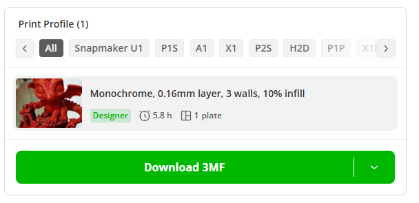
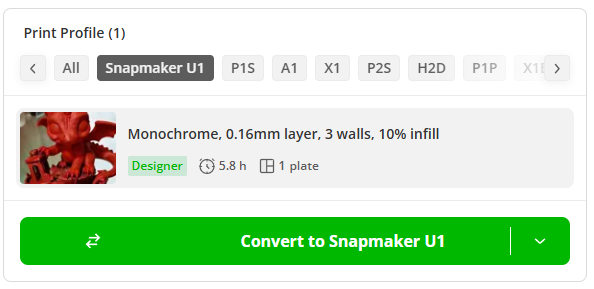
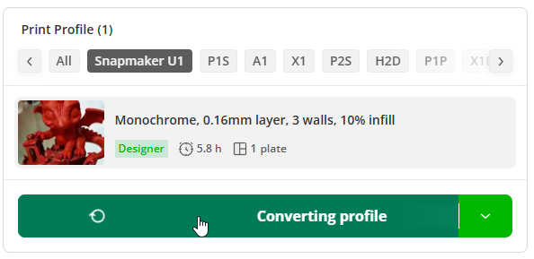
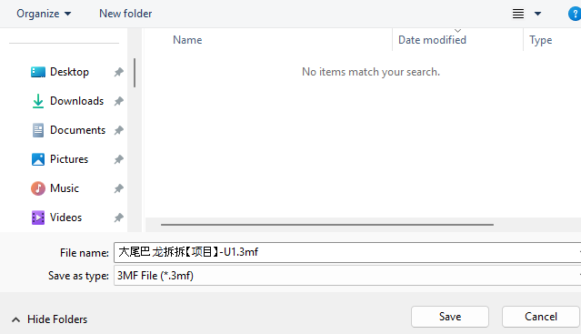
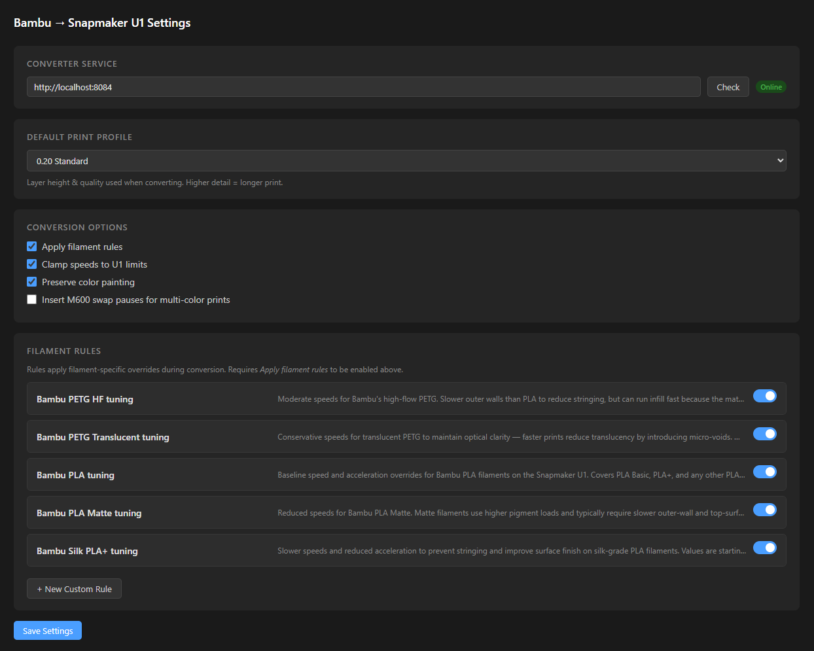

# Bambu to Snapmaker U1 — Chrome Extension

<a href="https://www.buymeacoffee.com/gmeek" target="_blank"></a>

A Chrome extension that adds a **Snapmaker U1** option to MakerWorld's printer filter carousel. Selecting it converts any model's print profile from Bambu Lab format to Snapmaker U1 format and downloads the converted `.3mf` file — without leaving your browser.

## How it works

The extension injects a **Snapmaker U1** tile into the printer filter carousel on any MakerWorld model page. Clicking it swaps the download button to **Convert to Snapmaker U1**. One more click intercepts MakerWorld's own authenticated download, sends the `.3mf` to a locally-running conversion service, and saves the converted file.



*The injected Snapmaker U1 option appears alongside the standard printer filters.*

---



*Selecting Snapmaker U1 changes the button to Convert to Snapmaker U1.*

---



*While conversion runs, the button shows a spinner and "Converting profile".*

---



*The converted file is named after the original model with a `-U1.3mf` suffix.*

## Prerequisites

**The local conversion service must be running before you click Convert.**

Clone and start [bambu-to-snapmaker-u1](https://github.com/thadius83/bambu-to-snapmaker-u1) via Docker Compose:

```bash
git clone https://github.com/thadius83/bambu-to-snapmaker-u1.git
cd bambu-to-snapmaker-u1
docker compose up
```

The service runs at `http://localhost:8084` by default.

## Installation

This extension is not published to the Chrome Web Store. Load it unpacked:

1. Open Chrome and go to `chrome://extensions`
2. Enable **Developer mode** (top-right toggle)
3. Click **Load unpacked**
4. Select the `bambu-to-snapmaker-extension` folder

## Usage

1. Make sure the conversion service is running (`http://localhost:8084`)
2. Go to a MakerWorld model page, e.g. `https://makerworld.com/en/models/...`
3. Select a print profile from the profile list on the page
4. Click **Snapmaker U1** in the printer filter carousel
5. Click **Convert to Snapmaker U1**
6. The converted `.3mf` will download automatically

## Settings

Click the extension icon → **Options** to configure the service URL, default print profile, conversion options, and filament rules.



| Setting | Description |
|---|---|
| Converter Service | URL of the local conversion service (default: `http://localhost:8084`) |
| Default Print Profile | Snapmaker U1 reference profile used as the conversion base |
| Apply filament rules | Apply YAML-defined filament-specific speed and setting overrides |
| Clamp speeds to U1 limits | Prevent speeds that exceed the U1's hardware limits |
| Preserve color painting | Keep multi-color painting data from the original file |
| Insert M600 swap pauses | Add filament-change pauses for multi-color prints |

### Filament rules

The rules list shows all filament-specific tuning profiles included with the conversion service. Each rule can be toggled on or off, expanded to view and edit its YAML directly, or deleted. Custom rules can be added with **+ New Custom Rule**.

## Button states

| State | Icon | Label |
|---|---|---|
| Ready | Conversion arrows | Convert to Snapmaker U1 |
| Converting | Spinning arrow | Converting profile |
| Success | Checkmark | U1 profile ready |
| Error | Warning triangle | Conversion failed |

## Notes

- You must be **logged in to MakerWorld** for the download interception to work.
- Select a **print profile** on the model page before clicking Convert — the button needs an active profile to trigger the download.
- The extension intercepts MakerWorld's own authenticated fetch rather than making its own request, so no credentials are stored or transmitted by the extension.

## Credits and Attribution

The conversion service this extension depends on is [bambu-to-snapmaker-u1](https://github.com/thadius83/bambu-to-snapmaker-u1) by thadius83, licensed under [PolyForm Noncommercial 1.0.0](https://polyformproject.org/licenses/noncommercial/1.0.0/).

> **Required Notice: Copyright thadius83 (https://github.com/thadius83)**

## License

The extension code in this repository is licensed under the MIT License — see [LICENSE](LICENSE).

**Note:** Because this extension depends on `bambu-to-snapmaker-u1`, the combined workflow is subject to the PolyForm Noncommercial 1.0.0 license terms of that project. **Non-commercial use only.** Commercial use requires a separate license from thadius83.
